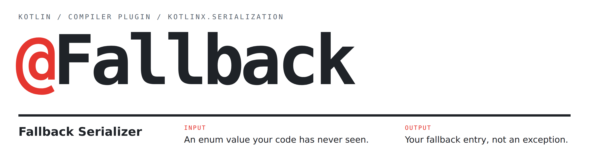

<p align="center">
  <picture>
    <source media="(prefers-color-scheme: dark)" srcset="docs/preview-dark.png">
    
  </picture>
</p>

[](https://central.sonatype.com/artifact/dev.jonpoulton.fallbackserializer/dev.jonpoulton.fallbackserializer.gradle.plugin)
[](LICENSE.txt)


A Kotlin compiler plugin which works alongside [kotlinx.serialization](https://github.com/Kotlin/kotlinx.serialization) to make enum decoding forwards-compatible. Mark one enum entry with a `@Fallback` annotation and any unknown name in your input data will decode to it, instead of throwing `SerializationException`.

## When is this useful?

Say you are building a client app to work with the schema of some upstream service. You receive a schema with an enum type, so you model it like below:

```kotlin
@Serializable
enum class OrderStatus {
  Pending,
  Shipped,
  Cancelled,
}

@Serializable
data class Order(
  val id: Long,
  val status: OrderStatus,
  // ...
)
```

This works swimmingly!

But then in the future, the server receives an update to add a new enum value to its schema: `Refunded`. You can update your clients to support that new value, but older clients without that update will still attempt to deserialize `Order` objects with the previous form of the enum. As such, they will fail decoding and discard the entire message, even if the order status was only a tiny part of the data!

Fallback Serializer allows you to define a "fallback value", which the generated serializer will default to if it fails to decode any other known value:

```diff
 @Serializable
 enum class OrderStatus {
   Pending,
   Shipped,
   Cancelled,
+  @Fallback Unknown,
 }
```

Now if you receive an otherwise-incompatible response:

```json
{
  "id": 123456,
  "status": "Refunded"
}
```

you'll decode to:

```kotlin
Order(id = 123456L, status = OrderStatus.Unknown)
```

and you can decide how to handle that case safely in your app logic.

## Setup

In `settings.gradle.kts`:

```kotlin
pluginManagement {
  repositories {
    mavenCentral()
  }
}
```

In `build.gradle.kts`:

```kotlin
plugins {
  kotlin("multiplatform") // or kotlin("jvm"), etc.
  kotlin("plugin.serialization")
  id("dev.jonpoulton.fallbackserializer") version "<version>"
}
```

The Gradle plugin adds the `dev.jonpoulton.fallbackserializer:runtime` dependency for you, which includes:
- the `Fallback` annotation, to be applied to your enum entries
- the `FallbackEnumSerializer` class, used as a base class for compiler-generated serializer types. You shouldn't need to touch this yourself.

The runtime supports every platform that kotlinx.serialization does.

### Kotlin version

The plugin needs the K2 compiler. Compiler plugins use internal compiler APIs, so each release only supports the Kotlin versions it's tested against:

| Plugin     | Kotlin                |
|------------|-----------------------|
| 0.1.0      | 2.4.20                |
| 0.2.0      | 2.4.20                |
| 0.3.0      | 2.4.0, 2.4.10, 2.4.20 |

The Gradle plugin warns on any other Kotlin version, since the compiler plugin might not work with it. To hide the warning, set `fallback.skipKotlinVersionCheck=true` in `gradle.properties`.

## Usage

```kotlin
import fallback.serializer.Fallback

// The serializer is generated by the plugin and applied automatically, so a plain @Serializable is
// all you need. OrderStatus.serializer() returns it if you want to pass it explicitly.
@Serializable
enum class OrderStatus {
  Pending,
  @SerialName("in_transit") Shipped,
  @Fallback Unknown,
}

Json.decodeFromString<OrderStatus>("\"Pending\"") // -> OrderStatus.Pending
Json.decodeFromString<OrderStatus>("\"in_transit\"") // -> OrderStatus.Shipped
Json.decodeFromString<OrderStatus>("\"Refunded\"") // -> OrderStatus.Unknown
```

Encoding the fallback entry uses its own name, so the original value is lost:

```kotlin
Json.encodeToString(OrderStatus.Unknown) // -> "Unknown", not "Refunded"
```

The above uses JSON as an example, but this works with other kotlinx.serialization formats too. It's tested with JSON, CBOR, ProtoBuf and [XML](https://github.com/pdvrieze/xmlutil). With ProtoBuf, which encodes enums as numbers, an unknown number decodes to the fallback.

Only unknown strings decode to the fallback. A value of the wrong type, like `123` or `null`, still fails to decode, except with `Json.decodeFromJsonElement`, which decodes it to the fallback too.

Enums without a `@Fallback` entry are left alone.

### Other features

- `@JsonNames` and other `@SerialInfo` annotations on the enum and its entries still work as expected.
- With multiplatform `expect`/`actual` enums, only the actual enum needs the `@Fallback` entry. Decoding from common code still uses the fallback.
- With `coerceInputValues = true`, `Json` swaps an unknown value for the property's default before this plugin sees it. So a property with a default gets that default, and one without a default gets the fallback entry:

```kotlin
@Serializable
data class Order(val withDefault: OrderStatus = OrderStatus.Pending, val withoutDefault: OrderStatus)

val json = Json { coerceInputValues = true }
json.decodeFromString<Order>("""{"withDefault":"Refunded","withoutDefault":"Refunded"}""")
// -> Order(withDefault = OrderStatus.Pending, withoutDefault = OrderStatus.Unknown)
```

## Guardrails

The plugin includes a number of built-in usage checkers which make sure the `@Fallback` annotation is being applied properly. These will fail the build in any of the following cases:

- An enum has more than one `@Fallback` entry.
- An enum has a `@Fallback` entry but isn't annotated with `@Serializable` (or an annotation marked with `@MetaSerializable`), which would otherwise ignore the fallback without telling you.
- An enum with a `@Fallback` entry passes a `with` argument to `@Serializable`, since that serializer would be used instead of the generated one and the fallback would be ignored.
- An actual enum has no `@Fallback` entry, but its expect enum does.
- An expect enum and its actual enum mark different entries with `@Fallback`.
- `@Fallback` is used anywhere besides an enum entry.

If you find any other cases that should be caught, please [open an issue](https://github.com/jonapoul/fallback-serializer/issues).

kotlinx.serialization's `coerceInputValues` performs a similar function, but it only covers class properties that have a default value. This plugin is applied to the enum type, so it works anywhere the enum is decoded, including top-level values and collections. One unknown value in a list doesn't stop the rest of it from decoding.

## License

```
Copyright 2026 Jon Poulton

Licensed under the Apache License, Version 2.0 (the "License");
you may not use this file except in compliance with the License.
You may obtain a copy of the License at

   https://www.apache.org/licenses/LICENSE-2.0

Unless required by applicable law or agreed to in writing, software
distributed under the License is distributed on an "AS IS" BASIS,
WITHOUT WARRANTIES OR CONDITIONS OF ANY KIND, either express or implied.
See the License for the specific language governing permissions and
limitations under the License.
```
